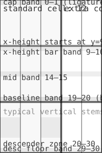

# unst Type

## Letter Sample


![\]](src/character-u005d.svg)


## Grid



## Usage

```css
@font-face {
  font-family: "unst";
  font-style: normal;
  font-weight: 400;
  font-display: swap;
  src:
    url("https://hetcdn.nl/fonts/unst.woff2") format("woff2"),
    url("https://hetcdn.nl/fonts/unst.woff") format("woff"),
    url("https://hetcdn.nl/fonts/unst.ttf") format("truetype");
}

:root {
    --font--unst: "unst", system-ui, -apple-system, "Segoe UI", Roboto, Arial, sans-serif;
}

.font--unst {
  font-family: var(--font--unst);
  font-weight: 400;
  font-style: normal;
}
```

### Change Dimensions

```css
.font--unst {
    font-variation-settings: "wdth" 400, "hght" 400;
}
```

Both ``wdth`` and `hght` can take on a value between 25 and 400, 100 being the default.

## Add Glyphs

1. Design new glyph using the [glyph designer](tools/glyph-designer.html).
2. Save SVG to ``src``.
3. Run `py tools\generate-data.py`.
4. Run `py tools\generate-fonts.py`.
5. Run `py tools\generate-manifest.py`.
